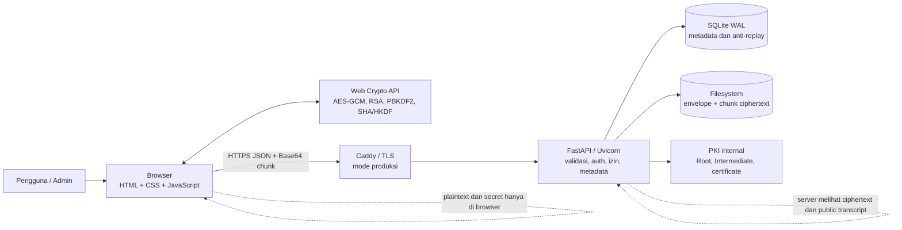
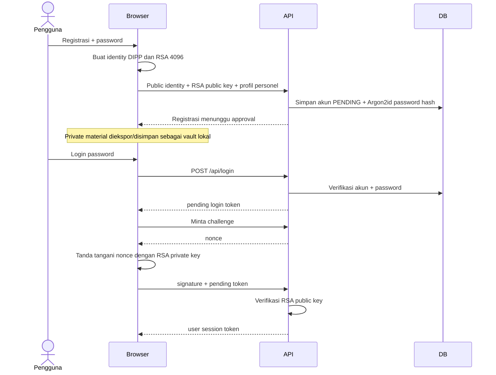
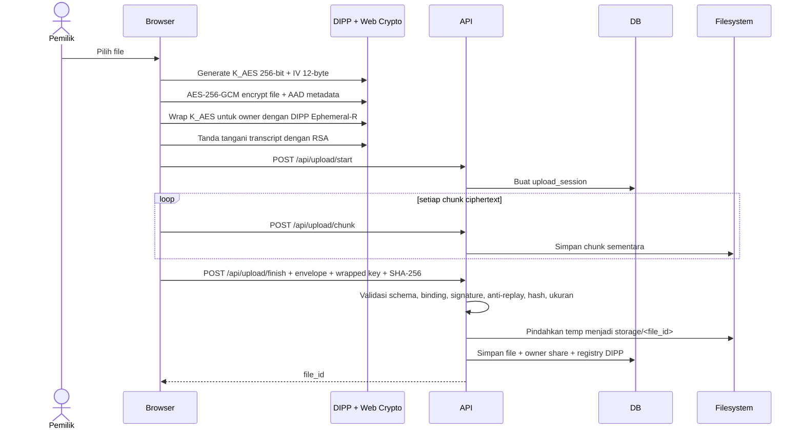
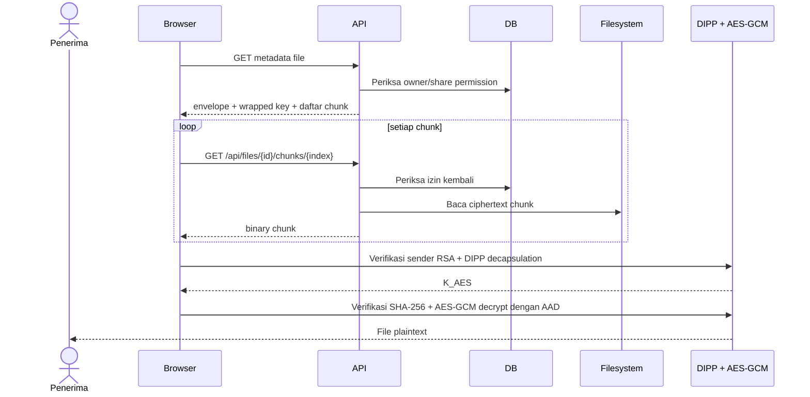
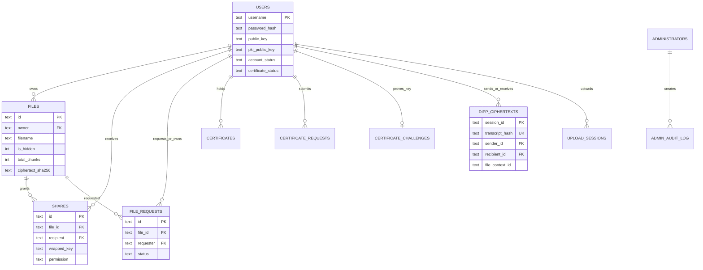
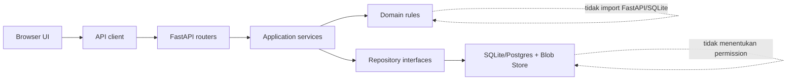
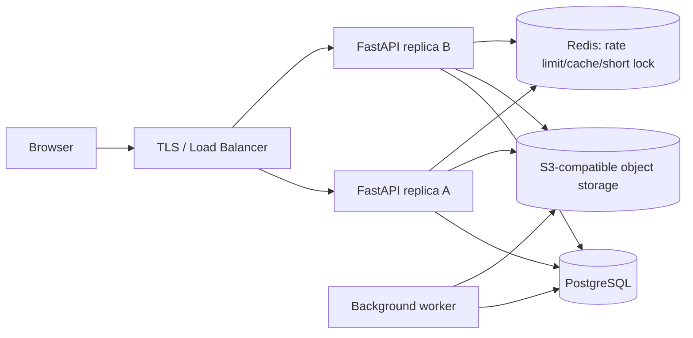
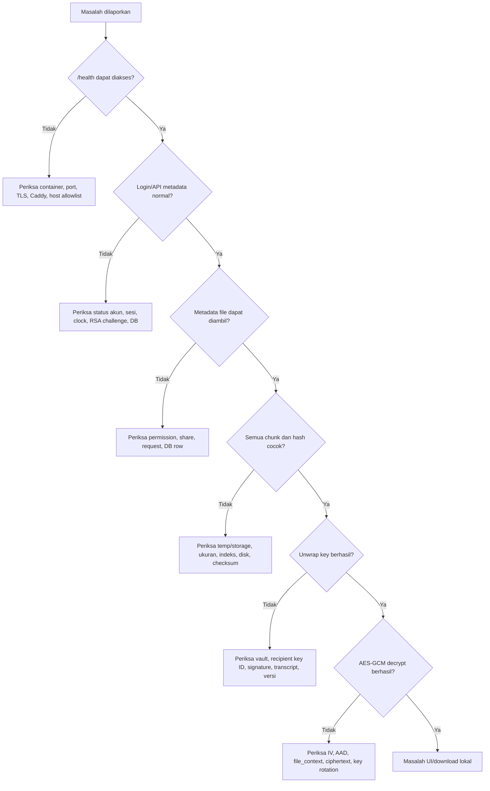
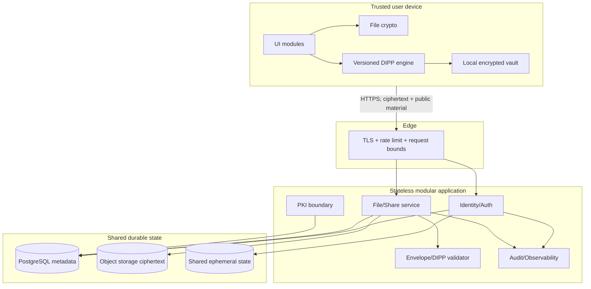

# Konsep Arsitektur dan Panduan Pengembangan ONE_MIND DIPP

> **Status dokumen:** baseline arsitektur, troubleshooting, dan roadmap pengembangan
> **Tanggal pemetaan:** 18 Agustus 2026
> **Sistem yang dipetakan:** ONE_MIND DIPP Ephemeral-R weighted E2048 R10S12S Q2500K v5
> **Tujuan:** menjadi acuan manusia dan AI saat memperbaiki, menguji, atau mengembangkan sistem tanpa kehilangan konteks keamanan dan kompatibilitas.

---

## 1. Ringkasan eksekutif

ONE_MIND DIPP adalah aplikasi pertukaran file terenkripsi dengan pola **client-side encryption**:

- browser mengenkripsi isi file menggunakan **AES-256-GCM**;
- browser membungkus kunci AES untuk setiap penerima menggunakan **DIPP Ephemeral-R**;
- browser menandatangani transcript DIPP menggunakan **RSA 4096 / SHA-512**;
- server FastAPI mengautentikasi pengguna, memvalidasi struktur dan tanda tangan, mengatur izin, serta menyimpan ciphertext;
- server tidak dirancang untuk menerima plaintext, kunci file AES, titik privat penerima `x_B`, titik ephemeral `R_i`, pre-key, atau `K_DIPP`;
- SQLite menyimpan metadata, hak akses, PKI, audit admin, sesi upload, dan registry anti-replay;
- filesystem menyimpan chunk ciphertext dan envelope;
- Docker menjalankan aplikasi; mode produksi menggunakan Caddy sebagai terminasi TLS dan reverse proxy.

Arsitektur saat ini cocok disebut **modular monolith yang masih terkonsentrasi**. Deployment-nya sederhana dan cukup mudah dipahami, tetapi sebagian besar backend masih berada dalam `app/main.py` dan sebagian besar frontend berada dalam `static/app.js`. Arah pengembangan yang disarankan adalah **memecahnya menjadi modular monolith terlebih dahulu**, bukan langsung menjadi microservices.

> **Peringatan keamanan:** profil DIPP aktif adalah parameter penelitian/correctness eksperimental. Hasil uji empiris bukan bukti keamanan kriptografi universal dan tidak boleh dipasarkan sebagai pengganti KEM standar atau sebagai jaminan post-quantum production.

---

## 2. Cara membaca dokumen

Dokumen ini membedakan tiga jenis informasi:

| Label | Arti |
|---|---|
| **AKTUAL** | Sudah terdapat pada kode yang dipetakan. |
| **TARGET** | Bentuk arsitektur yang disarankan untuk pengembangan. |
| **KEPUTUSAN BARU** | Perlu ADR, desain, test vector, dan persetujuan sebelum diterapkan. |

Ada dua area kode yang terkait:

1. **Aplikasi utama** berada pada folder sibling `APP_GOOGLEDRIVE/.AAA_One_Mind_DIPP`. Seluruh path seperti `app/main.py` dan `static/app.js` dalam dokumen ini mengacu ke root aplikasi tersebut.
2. **Workspace eksperimen/audit** berisi `q_modulus_sweep.js`, `secret_cluster_sweep.js`, `secret_chain_sweep.js`, serta laporan sweep. Alat-alat ini membaca implementasi aplikasi utama ke memori untuk penelitian dan tidak boleh dianggap sebagai runtime produksi.

---

## 3. Prinsip arsitektur

Prinsip berikut menjadi pagar pengaman saat manusia atau AI mengubah kode:

1. **Plaintext dan secret tetap di sisi klien.** Server hanya menerima public material, metadata tervalidasi, wrapped key, dan ciphertext.
2. **Protokol kriptografi adalah kontrak versi.** Perubahan field, canonicalization, parameter, AAD, nonce, KDF, atau representasi integer wajib dianggap sebagai perubahan protokol.
3. **Validasi dilakukan berlapis.** Browser memberi pengalaman pengguna; server tetap menjadi otoritas validasi dan otorisasi.
4. **Deny by default.** Akses file hanya diberikan jika relasi owner/share dan status akun/certificate memenuhi aturan.
5. **Pisahkan domain dari infrastruktur.** Aturan akses, upload, PKI, dan DIPP tidak boleh bergantung langsung pada detail FastAPI atau SQLite setelah modularisasi.
6. **Observability tanpa membocorkan secret.** Log harus cukup untuk troubleshooting, tetapi tidak boleh memuat token, password, private key, raw file key, plaintext, vault, atau seluruh wrapped envelope.
7. **Scale berdasarkan bottleneck terukur.** Jangan memecah menjadi service terpisah sebelum modular monolith mempunyai batas modul dan metrik yang jelas.
8. **AI menghasilkan usulan, test, dan dokumentasi; manusia memegang keputusan keamanan.** Perubahan crypto, auth, PKI, dan recovery selalu membutuhkan review manusia.

---

## 4. Konteks sistem aktual



### Batas kepercayaan

| Zona | Dipercaya untuk | Tidak boleh dipercaya untuk |
|---|---|---|
| Browser pengguna | plaintext, private identity, kunci AES, operasi encrypt/decrypt | menjadi satu-satunya validator aturan server |
| API server | autentikasi, otorisasi, validasi envelope, anti-replay, metadata | mengetahui plaintext atau kunci file |
| SQLite | metadata konsisten dan transaksi lokal | penyimpanan multi-node tanpa migrasi database |
| Filesystem | menyimpan ciphertext chunk dan envelope | sinkronisasi otomatis antar replica |
| Reverse proxy | TLS publik, header, routing | memproses secret aplikasi |
| Workspace audit | eksperimen parameter dan pengukuran | jalur produksi atau bukti keamanan formal |

---

## 5. Peta komponen aktual

| Komponen | Lokasi | Tanggung jawab utama | Catatan |
|---|---|---|---|
| Backend API | `app/main.py` | endpoint, schema Pydantic, auth, izin, database, upload, DIPP validation, static serving | **Monolit besar:** sekitar 3.754 baris saat dipetakan. |
| Password | `app/auth/passwords.py` | Argon2id, verifikasi hash lama PBKDF2, rehash | Modul sudah terpisah dengan baik. |
| PKI | `app/pki/pki.py` | Root/Intermediate CA, CSR, issue, verify, revoke, rotasi | Pisahkan private CA dari web process saat maturity meningkat. |
| Frontend | `static/app.js` | state, auth, UI, encrypt/decrypt, upload/download, sharing, admin | **Monolit besar:** sekitar 3.449 baris saat dipetakan. |
| Mesin DIPP | `static/dipp_ephemeral_r.js` | identity, vault, encapsulate, decapsulate, wrap/unwrap file key | Implementasi protokol aktif; perubahan wajib test vector. |
| UI | `static/index.html`, `static/styles.css` | struktur halaman dan tampilan | Vanilla frontend tanpa bundler. |
| Container | `Dockerfile`, `scripts/entrypoint.sh` | image Python, dependency, direktori runtime, Uvicorn/TLS | Uvicorn dijalankan satu process. |
| Orkestrasi lokal | `docker-compose.yml` | port 8444, volume `data`/`certs`, healthcheck | Cocok untuk single node. |
| Produksi | `docker-compose.prod.yml`, `deploy/Caddyfile` | Caddy, TLS, named volume | App HTTP internal pada port 8080. |
| Test Python | `tests/test_*.py` | auth, input security, PKI, file request, chunk, server DIPP | Pertahankan sebagai regression gate. |
| Test DIPP JS | `tests/test_dipp_ephemeral_r.js` | primitive, encapsulation, vault, tamper/freshness | Harus jalan untuk setiap perubahan crypto. |
| Audit penelitian | file `*_sweep.js` dan `*_REPORT.md` | sweep modulus, scale, cluster, chain | Research-only; menginstrumentasi source di memori. |

### Struktur runtime data aktual

```text
data/
├── database/
│   └── one_mind.sqlite3
├── keys/
│   └── server_secret.bin
├── storage/
│   └── <file_id>/
│       ├── envelope.json
│       ├── chunk_000000.bin
│       └── ...
├── temp_uploads/
│   └── <upload_id>/
└── pki/
    ├── root/
    ├── intermediate/
    ├── issued/
    ├── csr/
    └── revoked/
```

`data/`, `certs/`, `.env`, vault pengguna, private key, dan database runtime tidak boleh dimasukkan ke Git atau prompt AI.

---

## 6. Alur data utama

### 6.1 Registrasi dan login



Catatan implementasi:

- password baru di-hash dengan Argon2id;
- hash PBKDF2 lama dapat diverifikasi lalu di-upgrade saat login;
- token user, pending-login, dan admin dipisahkan dengan field `type` dan HMAC-SHA-256;
- rate limit login saat ini tersimpan dalam memori process;
- token browser saat ini berada di `localStorage`, sehingga XSS adalah risiko penting;
- masa sesi default adalah 300 detik, dapat diatur melalui environment variable.

### 6.2 Upload file terenkripsi



Properti penting:

- plaintext dienkripsi sebelum upload;
- `file_context_id` mengikat envelope file dengan wrapped key;
- server menghitung ulang hash gabungan chunk;
- proses finish menggunakan transaksi database dan rollback filesystem sebisa mungkin;
- owner juga direpresentasikan sebagai record `shares` dengan permission `owner`.

**Bottleneck aktual:** fungsi browser membaca seluruh `Blob` ke `ArrayBuffer`, mengenkripsi seluruh file, lalu memecah ciphertext menjadi chunk. Artinya batas API 20 GB tidak sama dengan kemampuan memori browser. Dukungan file sangat besar memerlukan desain **streaming encryption** baru dan versi format file baru; ini bukan refactor kosmetik.

### 6.3 Download dan decrypt



Jika recipient belum mempunyai wrapped key, pemilik harus membungkus ulang **kunci file yang sama** untuk public identity recipient. Ciphertext file tidak perlu dienkripsi ulang hanya untuk menambah viewer.

### 6.4 Share, request akses, dan rotasi

- File dapat tersembunyi atau tampil pada katalog metadata.
- Pengguna dapat meminta akses hanya pada file yang visible.
- Owner menyetujui permintaan dengan membuat wrapped key untuk requester.
- Permission yang dikenal adalah `owner`, `editor`, dan `viewer` sesuai aturan endpoint.
- Revoke share menghapus akses metadata/wrapped key, tetapi tidak dapat menarik kembali plaintext yang sebelumnya telah diunduh penerima.
- Rotasi file key memerlukan decrypt/re-encrypt ciphertext dan pembuatan ulang wrapped key untuk setiap penerima aktif.

### 6.5 Admin dan PKI

- admin setup hanya tersedia saat belum ada administrator;
- admin dapat approve, reject, revoke, restore, dan soft-delete akun;
- aktivitas admin dicatat pada `admin_audit_log`;
- PKI mempunyai Root CA dan Intermediate CA;
- setelah rotasi Intermediate CA, certificate yang tidak cocok ditandai perlu diterbitkan ulang;
- pada maturity yang lebih tinggi, private Root CA idealnya offline dan operasi Intermediate CA tidak berada dalam process web publik.

---

## 7. Lifecycle kunci dan data sensitif

| Material | Dibuat di | Disimpan di | Diketahui server? | Aturan |
|---|---|---|---|---|
| Password user | pengguna | hanya hash Argon2id di DB | plaintext sesaat saat login | jangan log atau simpan plaintext |
| DIPP private identity / `x_B` | browser | vault `.dipp` terenkripsi / sesi browser | tidak | backup vault wajib oleh pengguna |
| DIPP public identity | browser | DB server | ya | validasi schema, key ID, dimensi, domain |
| RSA private login/signing key | browser | paket/vault lokal pengguna | tidak | jangan ekspor tanpa enkripsi dan konfirmasi |
| RSA public key | browser | DB server | ya | dipakai untuk challenge dan signature transcript |
| `K_AES` file | browser | tidak disimpan mentah; hanya wrapped per penerima | tidak | zeroize buffer jika memungkinkan |
| `K_DIPP` | browser | ephemeral memory | tidak | tidak boleh masuk log/error telemetry |
| Pre-key dan `R_i` | browser | ephemeral memory | tidak | dibersihkan setelah derivasi |
| Ciphertext file | browser | filesystem server | ya | hash, ukuran, dan chunk divalidasi |
| Wrapped key | browser | DB `shares` | ya, tetapi tidak dapat dibuka server sesuai desain | transcript harus signed dan anti-replay |
| Server signing secret | server | `data/keys/server_secret.bin` | ya | backup terenkripsi; rotasi memutus sesi aktif |
| Root/Intermediate CA private key | server saat ini | `data/pki/...` | ya | proteksi paling tinggi; rencanakan pemisahan/offline root |

---

## 8. Model data aktual



Catatan:

- SQLite memakai `WAL` dan foreign key.
- Schema/migrasi saat ini dijalankan dari fungsi inisialisasi aplikasi.
- `dipp_ciphertexts` adalah registry anti-replay berdasarkan `session_id` dan unique `transcript_hash`.
- Untuk tim dan deployment yang bertumbuh, migrasi schema sebaiknya dipindahkan ke tool versioned seperti Alembic.

---

## 9. Bagaimana kode dibangun dan seharusnya dikembangkan

### 9.1 Pola implementasi fitur saat ini

Satu fitur end-to-end umumnya melintasi lapisan berikut:

```text
UI event di static/app.js
    ↓
helper api()/apiBinary()
    ↓
Pydantic StrictInputModel di app/main.py
    ↓
FastAPI endpoint + dependency current_user/current_admin
    ↓
validasi domain/crypto + SQL parameterized
    ↓
SQLite dan/atau filesystem
    ↓
response JSON/binary
    ↓
render state dan pesan UI
```

Untuk perubahan baru, urutan kerja yang aman adalah:

1. tulis use case dan siapa yang berhak menjalankannya;
2. tulis invariant keamanan dan kondisi gagal;
3. tetapkan apakah format/protokol berubah;
4. tulis atau ubah test lebih dahulu;
5. buat schema input strict;
6. implementasikan service/domain rule;
7. implementasikan repository/storage;
8. expose endpoint;
9. integrasikan frontend;
10. jalankan regression, negative test, dan dokumentasikan keputusan.

### 9.2 Target struktur modular monolith

```text
app/
├── main.py                    # app factory, middleware, router registration
├── core/
│   ├── config.py              # typed environment settings
│   ├── errors.py              # error codes dan mapping HTTP
│   ├── logging.py             # structured logging + correlation ID
│   └── security.py            # headers dan token primitives
├── api/
│   ├── dependencies.py        # current_user/current_admin
│   └── routers/
│       ├── auth.py
│       ├── admin.py
│       ├── users.py
│       ├── files.py
│       ├── uploads.py
│       ├── shares.py
│       ├── requests.py
│       └── certificates.py
├── domain/
│   ├── models.py              # domain entity/value object
│   ├── permissions.py         # policy owner/editor/viewer
│   └── protocols.py           # identifier dan compatibility rule
├── schemas/
│   ├── auth.py
│   ├── files.py
│   ├── dipp.py
│   └── admin.py
├── services/
│   ├── auth_service.py
│   ├── upload_service.py
│   ├── file_service.py
│   ├── sharing_service.py
│   ├── dipp_validation_service.py
│   └── certificate_service.py
├── repositories/
│   ├── users.py
│   ├── files.py
│   ├── shares.py
│   └── replay.py
├── infrastructure/
│   ├── database.py
│   ├── migrations/
│   ├── blob_store.py
│   ├── local_blob_store.py
│   └── pki_store.py
└── auth/
    └── passwords.py

static/
├── index.html
├── styles.css
└── js/
    ├── main.js
    ├── state.js
    ├── api-client.js
    ├── errors.js
    ├── auth/
    ├── admin/
    ├── files/
    ├── crypto/
    │   ├── dipp_ephemeral_r.js
    │   ├── file-crypto.js
    │   └── key-vault.js
    └── ui/
```

### 9.3 Aturan dependency target



Aturannya:

- router hanya mengurus HTTP, dependency, dan serialisasi;
- service mengorkestrasi transaksi/use case;
- domain menentukan policy dan invariant;
- repository menyembunyikan SQL;
- blob-store interface menyembunyikan filesystem/object storage;
- crypto validator server terpisah dari operasi private crypto browser;
- frontend tidak menganggap tombol tersembunyi sebagai authorization control.

### 9.4 Strategi refactor tanpa big-bang

1. **Freeze behavior:** pastikan seluruh test aktual hijau dan simpan compatibility fixtures.
2. **Extract pure functions:** constants, canonical JSON, validators, permission policy.
3. **Extract routers dan schemas:** endpoint tetap memakai path/response yang sama.
4. **Extract repositories:** pindahkan SQL literal per aggregate tanpa mengganti database.
5. **Extract services:** pindahkan transaksi upload, sharing, dan certificate.
6. **Introduce interfaces:** `BlobStore`, `ReplayRegistry`, dan `UnitOfWork`.
7. **Baru ganti infrastruktur:** Postgres/object storage setelah contract test tersedia.
8. **Modularisasi frontend:** pindahkan helper tanpa mengubah wire format DIPP.

Satu pull request/refactor idealnya hanya memindahkan satu boundary dan tidak sekaligus mengubah protokol kriptografi.

---

## 10. Kontrak API, format, dan compatibility

Perubahan berikut **breaking** meskipun aplikasi masih dapat start:

- `DIPP_PROTOCOL_VERSION`, `DIPP_PARAMETER_SET`, atau `ENVELOPE_VERSION` berubah;
- urutan/key canonical JSON berubah;
- cara encode signed vector, Base64/Base64url, atau BigInt berubah;
- AAD AES-GCM berubah;
- `file_context_id`, sender, recipient, atau transcript binding berubah;
- jumlah komponen, modulus, radius, weighting, noise, KDF, hash, atau decoder berubah;
- format vault atau derivasi key ID berubah;
- format ciphertext/chunk atau konstruksi nonce berubah.

Gunakan tabel keputusan ini:

| Perubahan | Bump API? | Bump file/envelope? | Bump DIPP/vault? | Wajib test vector? |
|---|---:|---:|---:|---:|
| Pesan UI/CSS | tidak | tidak | tidak | tidak |
| Endpoint metadata baru additive | sebaiknya | tidak | tidak | contract test |
| Kolom DB internal | tidak | tidak | tidak | migration test |
| Permission rule | mungkin | tidak | tidak | authorization test |
| Streaming ciphertext format | ya | **ya** | tidak selalu | **ya** |
| Canonical transcript/AAD | ya | **ya** | **ya** | **ya** |
| Parameter DIPP | ya | **ya** | **ya** | **ya + crypto review** |

Setiap versi lama harus mempunyai keputusan eksplisit: `read+write`, `read-only/migrate`, atau `reject`. Jangan melakukan fallback diam-diam pada crypto lama.

---

## 11. Strategi skalabilitas

### Level 0 — single node aktual

Komponen: satu Uvicorn process, SQLite WAL, local filesystem, Docker volume.

Cocok untuk:

- pilot/lab;
- tim kecil;
- trafik rendah sampai sedang;
- kebutuhan operasional sederhana.

Batas:

- satu failure domain;
- rate limit berada di memori;
- SQLite dan filesystem lokal mencegah horizontal scaling langsung;
- upload via JSON Base64 menambah ukuran request dan penggunaan memori;
- frontend mengenkripsi seluruh file di memori;
- backup DB dan storage harus konsisten sebagai satu set.

### Level 1 — hardening single node

Lakukan sebelum menambah replica:

- modularisasi kode;
- versioned database migration;
- structured log dan correlation ID;
- metrics untuk latency, error, upload bytes, chunk retry, DB lock, dan storage usage;
- persistent rate limit atau reverse-proxy rate limit;
- backup terjadwal, encrypted, dan restore drill;
- cleanup upload session terukur;
- health/readiness checks terpisah;
- CI security/regression gates;
- uji beban berbasis pola file nyata.

### Level 2 — stateless application replicas

Target komponen:



Urutan migrasi:

1. buat repository contract test untuk SQLite;
2. tambah implementasi Postgres dan migrasi data;
3. buat `BlobStore` contract untuk local filesystem;
4. tambah object storage dengan checksum dan idempotency;
5. pindahkan rate limit dari memory ke shared store;
6. buat token secret/PKI key tersedia secara aman untuk semua replica;
7. tambahkan readiness yang mengecek DB dan object store;
8. baru tingkatkan replica.

### Level 3 — service separation hanya bila diperlukan

Pisahkan service hanya jika ada alasan terukur, misalnya:

- worker file memiliki beban/skalabilitas sangat berbeda dari API metadata;
- PKI memerlukan boundary compliance dan operator terpisah;
- audit log harus append-only pada sistem khusus;
- tim berbeda membutuhkan siklus release mandiri.

Kandidat boundary: Identity/Auth, File Metadata, Blob Transfer, PKI, dan Audit. DIPP private operations tetap di browser.

### Prioritas scalability paling berdampak

1. streaming upload binary, bukan Base64 JSON;
2. streaming authenticated encryption dengan format versioned;
3. object storage multipart + resumable upload;
4. Postgres untuk metadata/anti-replay;
5. idempotency key pada operasi finish/share/rotation;
6. background cleanup dan integrity verification;
7. horizontal replica setelah state bersama tersedia.

---

## 12. Troubleshooting berlapis

### 12.1 Prinsip “lapisan pertama yang gagal”



Jangan memulai dari crypto jika `/health` saja gagal. Jangan menyalahkan jaringan jika hash server dan client berbeda setelah seluruh chunk diterima.

### 12.2 Pemeriksaan 10 menit pertama

Jalankan dari root aplikasi utama:

```powershell
docker compose ps
docker compose logs --tail 200 one-mind
curl.exe -k https://localhost:8444/health
docker compose exec one-mind sh -lc "df -h /app/data && ls -ld /app/data /app/data/storage /app/data/temp_uploads"
docker compose exec one-mind sqlite3 /app/data/database/one_mind.sqlite3 "PRAGMA quick_check;"
```

Untuk mode produksi Caddy:

```powershell
docker compose -f docker-compose.prod.yml ps
docker compose -f docker-compose.prod.yml logs --tail 200 caddy one-mind
```

Jangan mencetak `.env`, `server_secret.bin`, private key PKI, vault, atau token ke terminal/chat.

### 12.3 Matriks gejala

| Gejala | Lapisan dugaan | Pemeriksaan | Tindakan aman |
|---|---|---|---|
| Container unhealthy | process/TLS/startup | log, port, certificate path, PKI init | perbaiki config; jangan hapus data |
| `400 Invalid host header` | TrustedHost | `ONE_MIND_ALLOWED_HOSTS` | tambahkan hostname eksplisit lalu restart |
| `401 sesi kedaluwarsa` | token/session | clock server, session seconds, localStorage token | login ulang; sinkronkan waktu |
| Password benar tetapi login gagal tahap kedua | RSA challenge | private enrollment key aktif, username binding, challenge expiry | import key yang benar; ulangi login |
| Akun tidak dapat login | account workflow | status PENDING/REVOKED/DELETED, certificate status | admin review; jangan edit DB manual |
| `413 request terlalu besar` | API/body/chunk | chunk profile, Base64 overhead, proxy limit | kecilkan chunk atau desain binary upload |
| `409 masih ada chunk` | upload session | total/uploaded/index file | retry chunk yang hilang; jangan finish paksa |
| `409 integrity check gagal` | transfer/storage | client SHA-256, ukuran chunk, disk | upload ulang; investigasi corruption |
| File terlihat tetapi tidak dapat dibuka | key/permission | record share, recipient, key ID, vault | pastikan wrapped key ditujukan ke identity aktif |
| `Decapsulation Ephemeral-R gagal` | DIPP/signature/version | envelope version, key ID, sender key, transcript binding | jangan fallback; cari mismatch versi/tamper |
| AES-GCM decrypt gagal | ciphertext/key/AAD | hash, IV, AAD, filename/mime, file_context | hentikan; jangan abaikan tag authentication |
| `database is locked` | SQLite concurrency | request paralel, transaksi panjang, disk | kurangi concurrency; ukur; rencanakan Postgres |
| Disk cepat penuh | storage/temp | volume storage, orphan temp upload | jalankan cleanup terkontrol setelah backup |
| Certificate menjadi REPLACED | PKI rotation | fingerprint Intermediate aktif | lakukan reissue dengan proof yang valid |
| Berhasil lokal, gagal domain | proxy/TLS | Caddy log, DNS, forwarded proto, allowlist | betulkan proxy/host, jangan matikan validasi |

### 12.4 Informasi minimum dalam laporan bug

```text
Waktu kejadian + timezone:
Environment/commit/image:
Role pengguna: admin/owner/editor/viewer
Endpoint atau langkah UI:
HTTP status + error code/pesan aman:
request_id/correlation_id:
file_id/upload_id/session_id yang sudah disensor bila perlu:
Ukuran file, chunk size, total chunk:
Versi envelope/protokol:
Apakah dapat direproduksi:
Hasil /health:
Potongan log yang tidak mengandung secret:
```

### 12.5 Logging target

Tambahkan log JSON dengan field:

- timestamp UTC;
- level;
- service/version;
- `request_id`;
- route template dan method;
- status dan latency;
- actor hash/pseudonymous ID bila diperlukan;
- `file_id`, `upload_id`, chunk index;
- protocol/envelope version;
- stable error code.

Jangan log:

- Authorization header/token;
- password atau hash lengkap;
- private key/vault;
- raw `K_AES`, `K_DIPP`, pre-key, `x_B`, atau `R_i`;
- plaintext/AAD sensitif;
- seluruh wrapped envelope atau signature jika tidak perlu.

---

## 13. Testing dan quality gate

### Test yang sudah ada

- password hashing, salt, PBKDF2-to-Argon2id migration;
- pemisahan/tamper token;
- RSA login challenge;
- PKI rotation/reissue;
- strict input, unknown field/query, content type, bounds, SQL injection payload;
- canonical envelope dan DIPP identifiers;
- replay, signature tamper, public-material substitution;
- chunk upload/download, hash, authorization, update, dan delete cleanup;
- file catalog/request approval;
- DIPP JavaScript primitive, vault, encapsulation, wrap/unwrap, dan rejection.

### Perintah regression aktual

```powershell
docker build --target test -t one-mind-dipp-tests .
docker run --rm -e ONE_MIND_DATA_DIR=/tmp/one-mind-dipp-tests one-mind-dipp-tests
node tests/test_dipp_ephemeral_r.js
```

### Quality gate per jenis perubahan

| Area berubah | Test minimum |
|---|---|
| UI/CSS | lint/syntax + smoke browser + accessibility dasar |
| Endpoint/schema | unit + API contract + unknown-field negative test |
| SQL/repository | unit + migration + rollback + permission integration |
| Upload/storage | missing/duplicate/out-of-order chunk, disk failure, checksum, retry |
| Auth/session | expiry, tamper, token type confusion, rate limit, status akun |
| PKI | chain, expiry, rotation, revoke, proof-of-possession |
| DIPP/crypto | known-answer vector, cross-browser, tamper setiap field, compatibility |
| Deployment | image scan, health/readiness, backup/restore, TLS check |

### Test tambahan yang disarankan

- property-based tests untuk canonical encoding dan vector bounds;
- concurrency test untuk upload finish dan replay registration;
- crash-consistency test antara DB transaction dan filesystem move;
- browser test untuk Chromium, Firefox, dan WebKit;
- load test dengan distribusi ukuran file nyata;
- fuzzing strict JSON/envelope validators;
- backup restore drill ke host bersih;
- fault injection: disk penuh, network putus, chunk retry, process restart;
- CSP/XSS test karena token berada di `localStorage`;
- crypto review independen dan test vector lintas implementasi.

### Definition of Done

Sebuah perubahan selesai jika:

- use case dan threat/invariant tertulis;
- test positif dan negatif hijau;
- tidak ada secret baru pada server/log/client storage tanpa desain;
- API/protocol compatibility diputuskan;
- migration dan rollback tersedia jika schema berubah;
- observability ditambahkan;
- dokumentasi dan ADR diperbarui;
- dependency baru diaudit dan dipin;
- reviewer manusia menyetujui perubahan auth/PKI/crypto;
- restore atau recovery path diuji bila menyentuh data.

---

## 14. Pengembangan dengan bantuan AI yang tetap dapat dipahami

### 14.1 Paket konteks minimum untuk AI

Berikan hanya:

- tujuan dan non-goal;
- file relevan, bukan seluruh repo;
- invariant keamanan;
- endpoint/schema/protocol version terkait;
- test yang harus tetap hijau;
- contoh data dummy;
- batas perubahan yang diizinkan.

Jangan berikan `.env`, database produksi, vault, private key, token, sertifikat privat, atau file pengguna.

### 14.2 Format permintaan perubahan

```markdown
## Tujuan
Apa hasil yang diinginkan?

## Non-goal
Apa yang tidak boleh diubah?

## Invariant
- Server tidak menerima plaintext/K_AES.
- Endpoint lama tetap kompatibel.
- Permission diperiksa di server.

## Area kode
File/modul yang boleh disentuh.

## Acceptance criteria
Perilaku yang dapat diuji.

## Test wajib
Daftar test positif, negatif, dan regression.

## Risiko
Auth, crypto, data migration, concurrency, atau operasi.
```

### 14.3 Aturan review hasil AI

1. minta AI menjelaskan data flow dan trust boundary yang berubah;
2. periksa diff, jangan hanya menjalankan hasil akhir;
3. tolak perubahan yang melemahkan validasi agar test lolos;
4. tolak fallback crypto diam-diam;
5. pastikan SQL parameterized dan authorization berada di server;
6. cari logging secret dan error yang terlalu detail;
7. jalankan test secara independen;
8. simpan alasan keputusan dalam ADR, bukan hanya dalam chat AI.

### 14.4 Template ADR singkat

```markdown
# ADR-NNN: Judul keputusan

- Status: proposed/accepted/deprecated
- Tanggal:
- Pemilik:

## Konteks
Masalah dan constraint.

## Keputusan
Pilihan yang diambil.

## Alternatif
Pilihan yang ditolak dan alasannya.

## Dampak
Security, compatibility, data, operasi, biaya.

## Verifikasi
Test, metric, dan rollback trigger.
```

ADR wajib untuk perubahan database utama, storage, auth, PKI, protocol, crypto parameter, atau deployment topology.

---

## 15. Roadmap pengembangan

### Prioritas 0 — jangan merusak baseline

- tag versi kode dan dokumentasikan build yang diuji;
- pastikan seluruh test aktual hijau;
- buat backup terenkripsi database + storage + server secret + PKI sebagai satu recovery set;
- lakukan restore drill;
- dokumentasikan risiko penelitian DIPP secara terbuka.

### Prioritas 1 — maintainability dan troubleshooting

- pecah `app/main.py` menjadi router/schema/service/repository;
- pecah `static/app.js` menjadi API, auth, file, crypto, admin, dan UI modules;
- typed configuration dengan validasi startup;
- stable error code dan correlation ID;
- Alembic/versioned migration;
- metrics dan dashboard operasional;
- persistent/distributed rate limit.

### Prioritas 2 — reliability file flow

- resumable/idempotent upload;
- endpoint binary chunk agar tidak memakai Base64 JSON;
- background orphan cleanup;
- reconciliation DB ↔ blob;
- quota pengguna dan kapasitas storage;
- antivirus/content scanning hanya jika threat model memungkinkan, dengan sadar bahwa server tidak melihat plaintext;
- backup consistency dan integrity scan.

### Prioritas 3 — scalability

- Postgres;
- object storage;
- shared rate-limit/session support;
- multiple API replicas;
- worker untuk cleanup/integrity/maintenance;
- load test dan autoscaling berdasarkan metrik nyata.

### Prioritas 4 — security maturity

- threat model formal;
- audit crypto independen;
- penetration test;
- evaluasi token dari `localStorage` menuju pola yang lebih tahan XSS;
- offline Root CA/HSM atau external CA service;
- secret manager dan prosedur rotasi;
- append-only security audit trail;
- dependency/SBOM/container scanning.

---

## 16. Bahan siap infografis

### Judul utama

**ONE_MIND DIPP — File Terenkripsi di Browser, Server Menyimpan Ciphertext**

### Pesan satu kalimat

> File dienkripsi sebelum meninggalkan perangkat; server mengatur identitas, izin, validasi, anti-replay, dan penyimpanan ciphertext tanpa dirancang untuk memiliki kunci pembuka file.

### Susunan 8 panel

1. **Pengguna memilih file** — plaintext masih di perangkat.
2. **Browser membuat kunci AES-256** — satu kunci file acak.
3. **AES-GCM mengenkripsi file** — menghasilkan ciphertext dan authentication tag.
4. **DIPP membungkus kunci AES** — wrapped key dibuat khusus untuk penerima.
5. **RSA menandatangani transcript** — identitas pengirim dan konteks terikat.
6. **Server memvalidasi** — schema, signature, recipient binding, ukuran, checksum, replay.
7. **Server menyimpan** — SQLite untuk metadata; storage untuk chunk ciphertext.
8. **Penerima membuka di browser** — unwrap key, verifikasi, lalu decrypt lokal.

### Tiga zona visual

| Zona | Warna usulan | Isi |
|---|---|---|
| Perangkat/secret | biru | plaintext, vault, private key, K_AES, decrypt |
| Transport/control | ungu | HTTPS, API, auth, permission, signature validation |
| Penyimpanan ciphertext | abu-abu/hijau | SQLite metadata, envelope, chunk terenkripsi |

### Ikon dan label singkat

- browser + gembok: **Encrypt lokal**;
- kunci: **Kunci file AES-256**;
- jaring/geometri: **DIPP Ephemeral-R wrap**;
- stempel: **RSA signed transcript**;
- perisai server: **Validate, authorize, anti-replay**;
- database: **Metadata saja**;
- tumpukan file terkunci: **Ciphertext chunks**;
- warning: **DIPP masih profil penelitian**.

### Callout “server tahu vs tidak tahu”

| Server tahu | Server tidak dirancang mengetahui |
|---|---|
| akun dan public key | password plaintext |
| metadata/permission | plaintext file |
| public transcript | DIPP private identity |
| ciphertext dan checksum | raw file key / `K_DIPP` |
| wrapped key | pre-key dan ephemeral `R_i` |

### Callout roadmap

```text
Sekarang
Single-node modular monolith
        ↓
Rapikan
Module + migration + observability + backup drill
        ↓
Perkuat transfer
Binary/resumable/streaming versioned format
        ↓
Scale
Postgres + object storage + shared state + replicas
```

### Catatan kaki wajib pada infografis

> Profil DIPP aktif masih merupakan implementasi penelitian dengan correctness empiris; confidentiality dan concrete security memerlukan analisis serta audit independen.

---

## 17. Checklist cepat sebelum mengembangkan fitur

- [ ] Apakah fitur menyentuh plaintext atau kunci?
- [ ] Apakah trust boundary berubah?
- [ ] Apakah permission diperiksa di server?
- [ ] Apakah schema input tetap strict dan menolak field asing?
- [ ] Apakah canonical JSON/AAD/transcript berubah?
- [ ] Apakah perlu bump versi API, file, vault, atau DIPP?
- [ ] Apakah perubahan kompatibel dengan file/vault lama?
- [ ] Apakah transaksi DB dan operasi storage crash-safe?
- [ ] Apakah retry dapat menyebabkan duplikasi/replay?
- [ ] Apakah log bebas secret?
- [ ] Apakah positive, negative, tamper, dan regression test tersedia?
- [ ] Apakah migration, backup, restore, dan rollback diuji?
- [ ] Apakah hasil AI sudah direview manusia?
- [ ] Apakah dokumentasi/ADR diperbarui?

---

## 18. North-star architecture

Arsitektur tujuan bukan “sebanyak mungkin service”, melainkan sistem yang mempunyai batas tanggung jawab jelas:



North star tersebut mempertahankan hal paling bernilai dari desain saat ini—crypto private di browser dan server ciphertext-only—sambil membuat backend lebih mudah diuji, storage dapat diganti, dan aplikasi dapat direplikasi ketika kebutuhan benar-benar muncul.

---

## 19. Sumber kebenaran teknis

Jika dokumen ini berbeda dengan kode, gunakan urutan otoritas berikut lalu perbarui dokumentasi:

1. test vector dan test keamanan yang disetujui;
2. spesifikasi implementasi aktif `docs/DIPP_CURRENT_IMPLEMENTED_SPEC_V5.md`;
3. implementasi `static/dipp_ephemeral_r.js` dan validator server;
4. kontrak API/test Python;
5. dokumen arsitektur ini;
6. chat/prompt AI.

Dokumen arsitektur harus diperbarui pada pull request yang mengubah trust boundary, penyimpanan, alur kunci, protokol, deployment, atau ownership modul.
